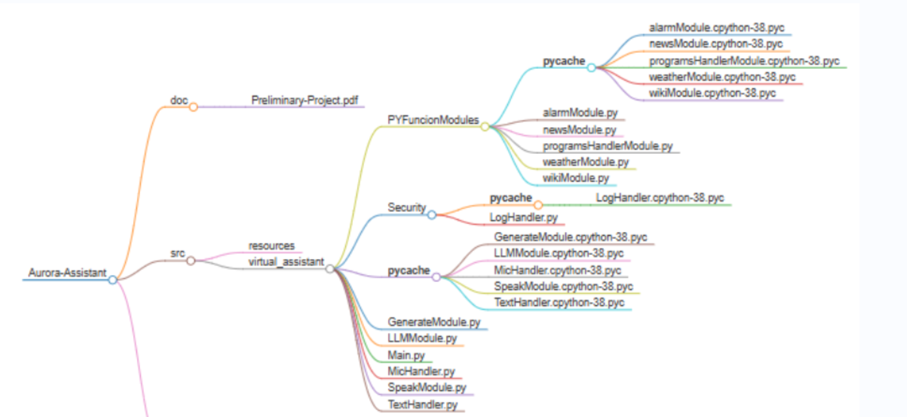
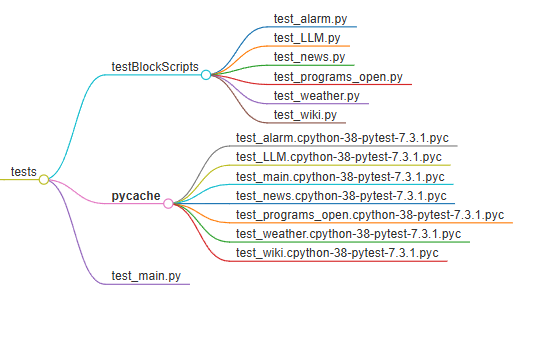

# Aurora-Assistant 🌟

Aurora is a versatile and intuitive virtual assistant developed in Python. Designed to streamline your daily tasks and improve productivity, Aurora leverages natural language processing to get things done. 🚀

## Features ℹ️

- **Information Retrieval**: Get instant access to weather updates, news headlines. 🌤️ 📰
- **Customizable**: Easily extend Aurora's capabilities by adding custom skills and integrations. 🛠️
- **User-Friendly Interface**: Interact with Aurora using natural language for a seamless experience. 💬

## Installation 🛠️

To install Aurora, follow these steps:

1. Clone the repository:

   ```bash
   git clone https://github.com/alejandroMortur/Aurora-Assistant.git
   ```

2. Install the dependences:

   ```bash
   pip install -r requirements.txt
   ```
3. Download LLM Studio an set down the model you want:

   Visit [LM Studio](https://lmstudio.ai) to download LLM Studio.

4. Gets your owns weather api key:

   Visit [visualcrossing](https://www.visualcrossing.com) to get yours owns weather api key.
5. Gets your owns new api key:

   Visit [newsapi](https://newsapi.org) to get yours owns news api key.

6. Run this comand on your terminal to launch de asistant:

   ```bash
   python .\Main.py
   ```

# Aurora project estructure:🌟



If you want to run all the tests without having to go 1 by 1, run the 'test_main.py' file



